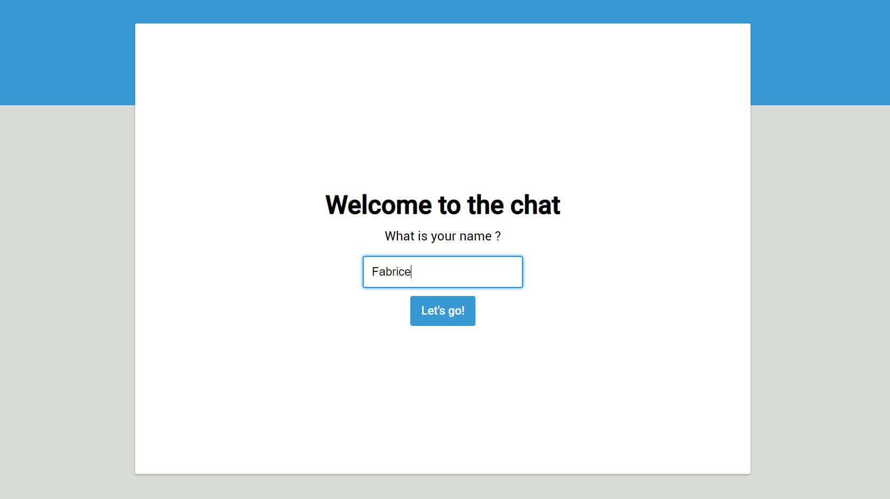
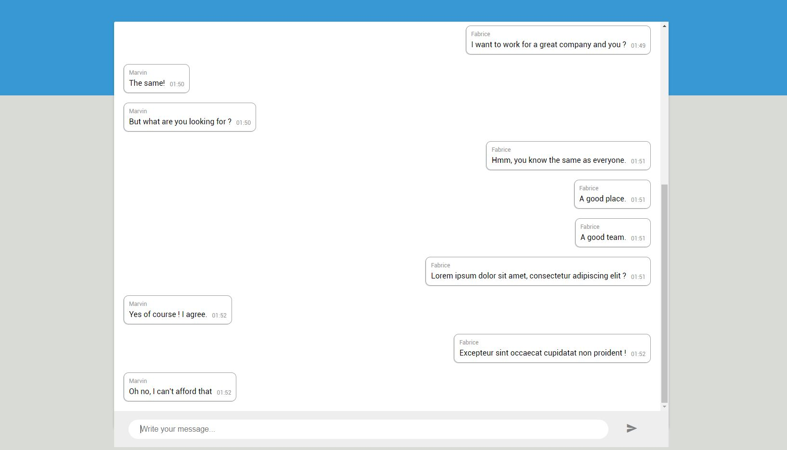

# Chat : Full-stack coding exercise


## Presentation

This application is a Whatsapp-like application. It provides realtime conversations with other people.

  
  
## Structure

### API
The api is done with Java 8 and Spring Boot 2.
It provides a websocket connection for realtime conversation.

### Front
The front is done with [Angular](https://angular.io). It's written in typeScript. 
But the code doesnt use here the functionality of typescript for the format of the exercise.

> Please, use JavaScript (Vanilla JS, React, ...). 

## Initiate the stack locally

### Database

For the project, we will launch a docker image of mongoDB and Kafka.

1. Install [Docker](https://docs.docker.com/install/)
2. Install [docker-compose](https://docs.docker.com/compose/install/)
3. To run Kafka and Mongo images, execute in the deploy folder: 
    ```
    docker-compose -f docker-compose.yml up -d
    ```
### API

1. Install Java 8 and [maven](https://maven.apache.org/install.html)
2. Generate the maven packages and the Avro file with :
    ```
    mvn compile
    ```

### Front

1. Install [NodeJs](https://nodejs.org/en/)
2. Install the dependencies :
    ```
    npm install -g @angular/cli
    ```
3. Install the module of the project in the front folder:
    ```
    npm i
    ```

## How to start locally

### API

Launch the API with : 

```
mvn spring-boot:run
```

### Front

Run the application in localhost:4200 in the front folder : 
```
ng serve -o
```

## What can be better :

- The api is not completely independent. It will be better if we don't use `User` and `Message` from the domain. 
We need to create new classes for the API and map `Domain` and `User` to them.
- For the purpose of the project, there is **NO test**. And this is a bad practice. We need to improve the test coverage.
- The format of messages are known. It could be interesting to check if SQL can be better.
- I use Angular to iterate quickly. But For better performance, it can be done without any framework, in pure JS.
